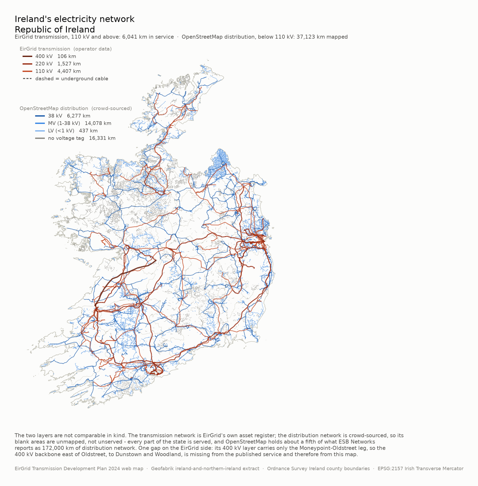

# Ireland's electricity network, from open data

Can OpenStreetMap stand in for ESB Networks' distribution data in the
SWIS-100-IE energy model? **Below 38 kV, no. At 38 kV and above, yes.** The
measurements behind that verdict, and what they mean for the model, are in
**[FINDINGS.md](FINDINGS.md)**.

This repo also draws the map that comes out of asking the question — the
transmission network from EirGrid's own asset register, over the distribution
network as volunteers have mapped it.



There is an interactive version of the distribution layer too:
`data/ireland_distribution_map.html`, self-contained, opens from disk with no
server. Voltage bands are separate layers and the point assets are clickable.

The two layers on that map are deliberately in different colour families,
because they are different kinds of claim. The warm lines come from EirGrid's
own asset register. The blue lines are what somebody happened to trace in
OpenStreetMap: blank areas are unmapped, not unserved.

## Data sources

| Source | Layer | Trusted for |
|---|---|---|
| [EirGrid Transmission Development Plan 2024](https://eirgrid-ie.maps.arcgis.com/apps/webappviewer/index.html?id=809889bb04744a3f89fd63499d35d6c1) web map (public ArcGIS service) | 110 / 220 / 400 kV lines, cables and stations | The 110 kV and 220 kV networks. The 400 kV layer is incomplete — see below. |
| [Geofabrik](https://download.geofabrik.de/europe/ireland-and-northern-ireland.html) `ireland-and-northern-ireland` OSM extract | sub-110 kV lines, poles, transformers, substations | The 38 kV layer. Nothing below it — see FINDINGS.md. |
| [Ordnance Survey Ireland statutory boundaries](https://services6.arcgis.com/MmUrOQU5v1he9gfS/arcgis/rest/services/Counties_OSi_Ireland/FeatureServer/0) via Esri Ireland | the 26 Republic of Ireland counties | Drawing, and attributing features to counties. |

The EirGrid figure checks out against its publisher: summing the geometry gives
5,348 km of overhead line and 774 km of underground cable, 6,122 km in total,
against EirGrid's published "6,500 km of overhead line and underground cable".
`python eirgrid.py summary` reproduces that.

**One gap the aggregate hides.** The 400 kV layer holds a single overhead
circuit — `MONEYPOINT-OLDSTREET`, 103 km, spanning longitude −9.42 to −8.27,
which is the western leg only. Ireland's 400 kV network continues east from
Oldstreet to Dunstown in Kildare and on to Woodland in Meath; EirGrid's own
"Dunstown–Moneypoint 400 kV Refurbishment" project names the full route, and
no circuit for those legs is in this service at any voltage. 400 kV is a small
share of the total so it barely moves the headline number, but do not use this
layer alone for anything that needs the 400 kV backbone to be whole.
`eirgrid.py summary` prints a warning to that effect.

## Layout

| Module | What it is |
|---|---|
| `network.py` | The OpenStreetMap layer: fetch, prefilter, voltage parsing, and the graph builder. One `load_lines()` serves every caller. |
| `eirgrid.py` | The EirGrid layer: paged ArcGIS download of the transmission network, plus county boundaries. |
| `plots.py` | Maps — the national one and one per analysis area. |
| `analysis.py` | The five measurements FINDINGS.md is built on. |
| `extract_web_data.py`, `extract_web_base.py`, `build_web_map.py` | The interactive Leaflet map of the distribution layer. |
| `psse.py` | EirGrid's TYTFS 2024 PSS/E v35 load-flow cases: a raw-format reader returning one DataFrame per section. See [docs/PHASE1_PARSER.md](docs/PHASE1_PARSER.md). |
| `pypsa_net.py` | Those cases as PyPSA networks, transmission-only or whole, exported as PyPSA CSV folders with a report table per decision. See [docs/PHASE2_PYPSA.md](docs/PHASE2_PYPSA.md). |
| `geocode.py` | Coordinates for the 110 kV+ buses, matched against OpenStreetMap substations, with a stated method for every match and a stated reason for every failure. |
| `northwest.py` | The North-West subnetwork — Wind Dispatch Tool constraint groups 1–3 — extracted in two views, and reconciled against a hand-built 15-node dataset. See [docs/PHASE3_NORTHWEST.md](docs/PHASE3_NORTHWEST.md). |
| `test_network.py`, `test_psse.py`, `test_pypsa_net.py`, `test_geocode.py`, `test_northwest.py` | Regression tests, mostly guarding things that would silently move a published number. |

## Running it

Redrawing the national map needs no OpenStreetMap download, because the
distribution lines are committed as a GeoPackage:

```bash
pip install -r requirements.txt
python eirgrid.py fetch          # ~5 s, about 8 MB
python plots.py national         # ~30 s -> data/national_network.png
```

Rebuilding everything from source is a much bigger job — a 392 MB extract, a
pyosmium prefiltering pass, and island-wide graph builds:

```bash
python network.py prepare        # download + prefilter + boundary cache
python analysis.py all           # the five measurements
python plots.py all              # every map
python -m pytest test_network.py
```

The interactive map is built from the same extract, separately:

```bash
python extract_web_data.py       # island-wide lines and sites, ways reassembled
python extract_web_base.py       # county and Northern Ireland outlines
python build_web_map.py          # data/ireland_distribution_map.html
```

The PyPSA networks are built from the TYTFS study files and one Overpass
download, both of which are already here:

```bash
python geocode.py match data/TYTFS2024_studyfiles/*_V35.raw   # bus coordinates
python pypsa_net.py build                                     # data/pypsa/
python pypsa_net.py verify                                    # DC PF and LOPF
python northwest.py verify                                    # the NW region
```

Each stage caches into `data/raw/` and skips itself if the cache is there, so
the commands are safe to re-run and there is no order to remember.

## Outputs

| File | Answers |
|---|---|
| `national_network.png` | What does the whole network look like, and how much of it does OSM have? |
| `ireland_distribution_map.html` | The same distribution layer, interactive and layer-by-layer. |
| `eirgrid_transmission.gpkg` | The 110 kV+ network: lines and stations, EPSG:2157. |
| `national_distribution.gpkg` | The sub-110 kV OSM lines for the Republic, banded by voltage. |
| `analysis.json` | Per area: tag coverage, length by band, component-size distributions, snapping sweep. |
| `national.json` | Island-wide, one voltage layer at a time: is each layer a network or a scattering? |
| `subtransmission.json` | Is the 38 kV-and-above layer usable on its own? |
| `missing_cable.json` | Lower bound on missing MV cable, from OSM's own asset counts. |
| `county_sweep.csv` | All 26 counties: mapped density per km², normalised. |
| `{kilkenny,mayo,dublin_city,dublin_county}_power.{png,gpkg}` | The four areas examined in detail. |
| `pypsa/<case>_<scope>/` | Each TYTFS case as a PyPSA CSV folder, transmission-only and whole, with a `reports/` table for every conversion decision. |
| `pypsa/geocoding/<case>.csv` | Where each 110 kV+ bus is, how it was matched, and why the unmatched ones were not. |
| `pypsa/northwest_<case>_<view>/` | The North-West region, 20 stations as TYTFS has them and 15 with generation folded into parents, with the circuit table and the boundary flows. |
| `osm_substations.csv` | The 1,705 named OSM substations and power plants the matching runs against. |

## Four things worth knowing before you read the numbers

- **The sub-110 kV layer is OpenStreetMap, not ESB.** ESB Networks appears here
  only as a published comparison figure (172,000 km). Getting the real thing
  means the ESB `.dgn` CAD files and the capacity heatmap; FINDINGS.md sets out
  an acceptance test for them.
- **Nothing below 38 kV is usable**, as topology or as a demand prior. That is
  the whole finding, and it is not a matter of degree — see FINDINGS.md §4
  (topology) and §6 (spatial prior).
- **Scope is the Republic of Ireland.** ESB Networks and EirGrid cover the
  Republic; Northern Ireland is NIE Networks and SONI, and is absent from the
  EirGrid dataset (which is why no 275 kV lines appear).
- **`graph-workshop/` is an unrelated project** that shares this checkout. It is
  a teaching workshop on graph Laplacians and shares no code with any of the
  above.
